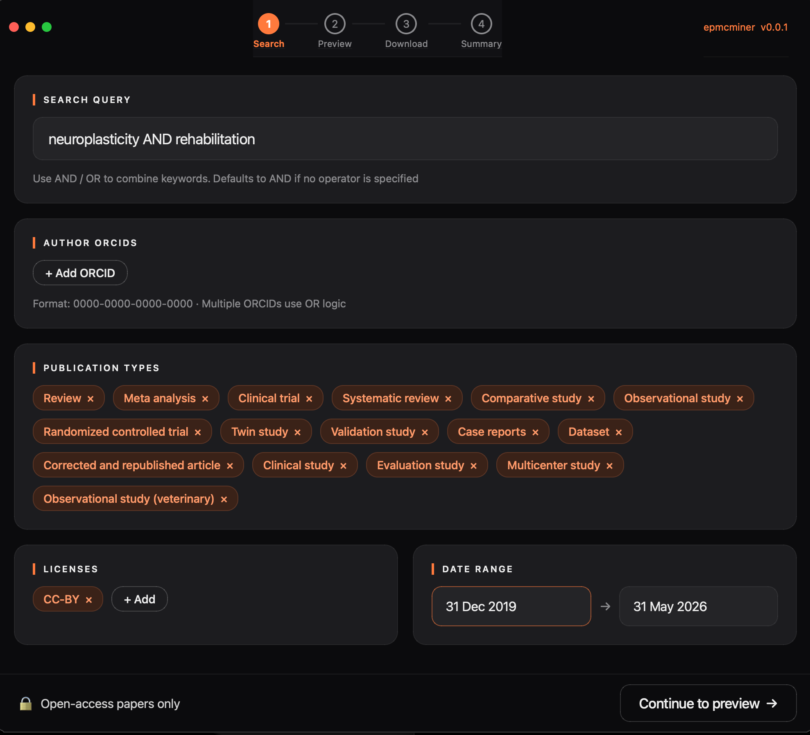
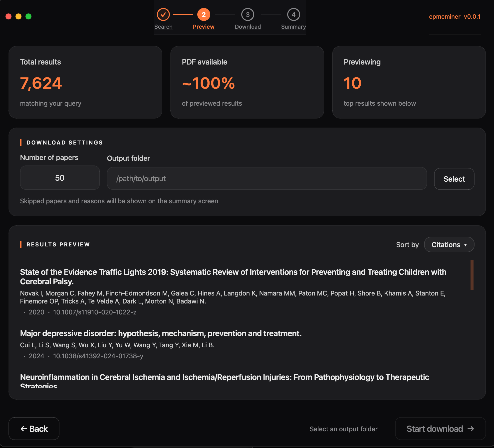
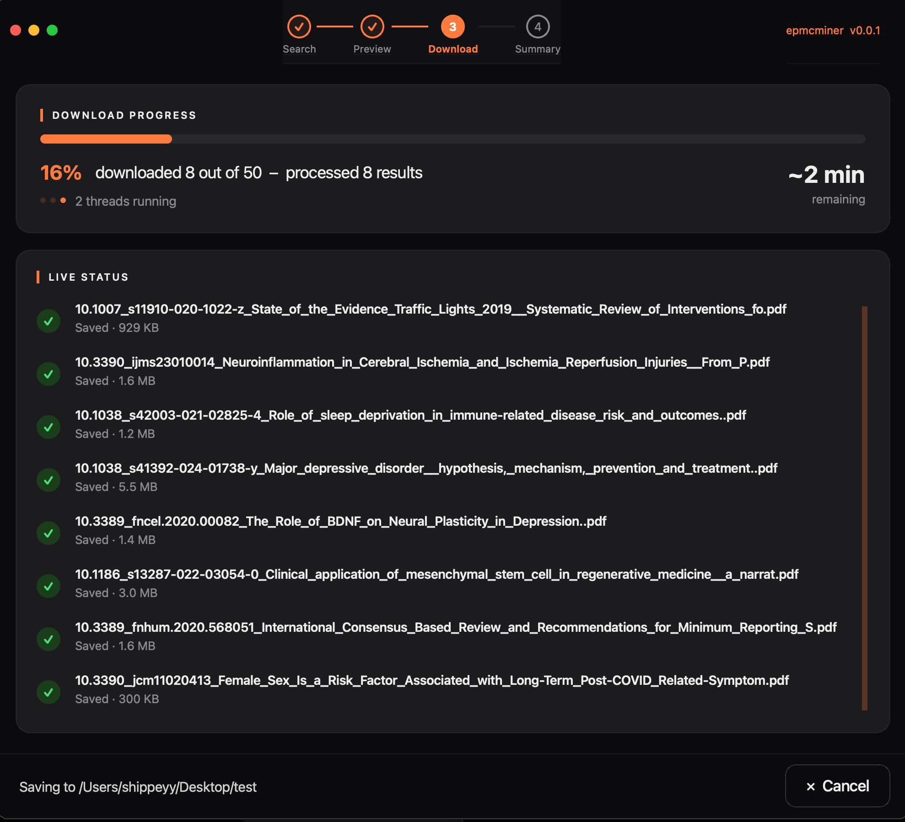
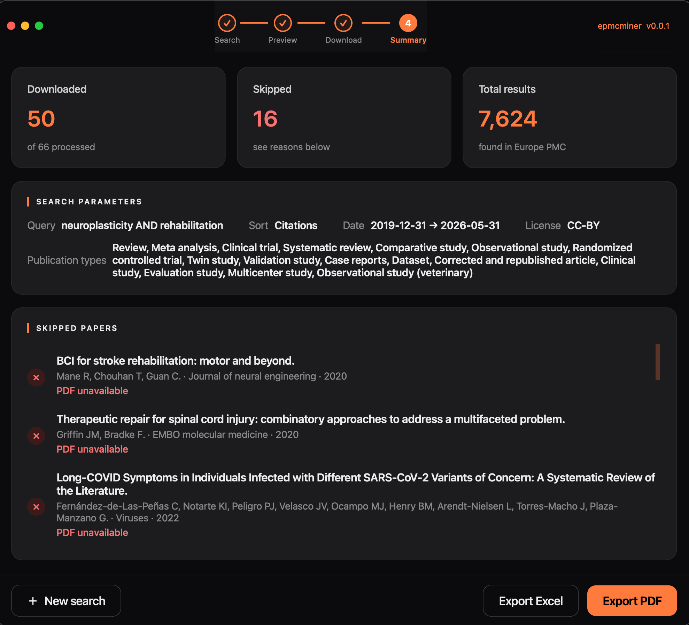

# epmcminer

## Table of Contents

<!-- TOC start (generated with https://github.com/derlin/bitdowntoc) -->

- [Overview](#overview)
- [Screenshots](#screenshots)
- [Usage](#usage)
- [Python API](#python-api)
  - [SearchParams](#searchparams)
  - [SearchService](#searchservice)
  - [DownloadService](#downloadservice)
  - [ReportService](#reportservice)
  - [OrcidValidationService](#orcidvalidationservice)
  - [Data models](#data-models)
- [Development](#development)
- [Architecture](#architecture)
- [Specifications](#specifications)

<!-- TOC end -->

<!-- TOC --><a name="overview"></a>
## Overview

A desktop application for researchers that automates the retrieval of academic literature from the [Europe PubMed Central (Europe PMC) API](https://europepmc.org/RestfulWebService). It allows users to define a search query and a set of filters, preview matching results, and download up to a specified number of open-access papers — including their PDFs and metadata — into a structured local folder.

epmcminer is designed for researchers in psychology and adjacent fields who need to systematically collect literature without manual searching and downloading. It requires no programming knowledge and provides a clean, step-by-step interface that guides the user from query construction to a downloadable report of results.

epmcminer only retrieves papers that are freely and legally available in full text. Papers that cannot be downloaded are clearly flagged in the final report with a reason. All searches are logged locally for reproducibility, and previously downloaded papers are automatically skipped on repeat runs.

**Core capabilities:**
- Keyword search with AND/OR logic against the Europe PMC database
- Filtering by date range, publication type, license, and author (via ORCID)
- Live results preview with adjustable sort order before committing to a download
- Parallel downloading of up to a user-specified count of PDFs with a real-time progress indicator
- A summary report exportable as PDF or Excel, containing the search query, filters applied, download results, paper metadata, and reasons for any skipped papers

---

<!-- TOC --><a name="screenshots"></a>
## Screenshots

<table>
  <tr>
    <td align="center" width="50%">
      <br>
      Screen 1 - Search and filter configuration
    </td>
    <td align="center" width="50%">
      <br>
      Screen 2 - Results preview and download settings
    </td>
  </tr>

  <tr>
    <td align="center" width="50%">
      <br>
      Screen 3 - Download progress
    </td>
    <td align="center" width="50%">
      <br>
      Screen 4 - Summary report
    </td>
  </tr>
</table>

<!-- TOC --><a name="usage"></a>
## Usage

### System prerequisites (Linux only)

PyQt6 requires two OpenGL/EGL system libraries that are not always present on minimal Linux installs:

```bash
sudo apt-get install -y libegl1 libgl1
```

macOS and Windows users do not need this step.

### Install and run

```bash
# either install via pip
pip install git+https://github.com/Programming-The-Next-Step-2026/epmcminer.git

# or clone the repo from github, install all dependencies and run locally in a new virtual environment
git clone https://github.com/Programming-The-Next-Step-2026/epmcminer.git
cd epmcminer
python -m venv .venv && source .venv/bin/activate
pip install -e ".[dev]"

# run the app
epmcminer
```

Then launch the application using either of the following:

```bash
# as a module
python -m epmcminer

# via the installed script
epmcminer
```

### Tutorial notebook

A step-by-step walkthrough of all four screens — with a worked example and sample output — is available as an interactive Jupyter notebook:

```bash
pip install jupyter
jupyter lab docs/vignette.ipynb
```

You can also view the rendered notebook on GitHub: [docs/vignette](docs/vignette.pdf).

---

<!-- TOC --><a name="python-api"></a>
## Python API

epmcminer can be used as a library without launching the GUI. All public classes and functions are importable directly from the top-level package.

```python
import epmcminer

search, download, report, orcid = epmcminer.create_application_services()
```

`create_application_services()` wires up all four services and returns them as a tuple. You can also instantiate them individually if you only need a subset (see each service section below).

---

### SearchParams

All searches are configured through a `SearchParams` dataclass. Only `query`, `date_from`, and `date_to` are required; everything else has a sensible default.

| Field | Type | Default | Description |
|---|---|---|---|
| `query` | `str` | — | Free-text search query. Multi-word terms without operators are joined with AND automatically. |
| `date_from` | `str` | — | Start of publication date range in ISO format (`YYYY-MM-DD`). |
| `date_to` | `str` | — | End of publication date range in ISO format (`YYYY-MM-DD`). |
| `publication_types` | `list[str]` | `[]` | Europe PMC publication types, e.g. `["Review", "Meta analysis"]`. Empty means all types. |
| `licenses` | `list[str]` | `[]` | License identifiers, e.g. `["CC-BY", "CC-BY-NC"]`. Empty means all licenses. |
| `author_orcids` | `list[str]` | `[]` | Author ORCID identifiers. Results matching any listed ORCID are included. |
| `sort_order` | `"relevance" \| "date" \| "citations"` | `"relevance"` | Result ordering. |
| `count` | `int` | `10` | Number of PDFs to successfully download. Must be > 0. |
| `output_folder` | `Path \| None` | `None` | Destination folder. Required by `DownloadService.download()`; optional for preview-only use. |

`SearchParams` validates itself on construction — passing an invalid date string, a reversed date range, or `count ≤ 0` raises `ValueError` immediately.

```python
from pathlib import Path
import epmcminer

params = epmcminer.SearchParams(
    query="depression AND therapy",
    date_from="2020-01-01",
    date_to="2024-12-31",
    publication_types=["Review", "Meta analysis"],
    licenses=["CC-BY"],
    sort_order="citations",
    count=25,
    output_folder=Path("/tmp/papers"),
)
```

---

### SearchService

```python
from epmcminer.api.client import EuropePMCClient
from epmcminer.services.search_service import SearchService

client = EuropePMCClient()
search = SearchService(client=client)
```

#### `preview(params) → SearchResult`

Fetches the first page of results (up to 10 papers) and returns a `SearchResult` with a total hit count and an estimate of how many have a downloadable PDF.

```python
result = search.preview(params)

print(f"{result.total_found} papers found")
print(f"~{result.estimated_downloadable} have a direct PDF link")

for paper in result.papers:
    print(f"{paper.title} ({paper.year})")
    print(f"  {paper.authors}")
    print(f"  {paper.journal}")
    print(f"  DOI: {paper.doi}")
    print(f"  PDF: {paper.pdf_url}")
```

#### `build_query(params) → str`

Returns the raw Europe PMC query string that `preview()` and `download()` send to the API. Useful for debugging or logging.

```python
query_string = search.build_query(params)
print(query_string)
# → '(depression AND therapy) AND (PUB_TYPE:"review" OR PUB_TYPE:"meta-analysis") AND ...'
```

---

### DownloadService

```python
import threading
from epmcminer.api.client import EuropePMCClient
from epmcminer.services.search_service import SearchService
from epmcminer.services.download_service import DownloadService

client = EuropePMCClient()
download = DownloadService(client=client, search_service=SearchService(client=client))
```

#### `download(params, progress_callback, cancel_event) → list[DownloadResult]`

Downloads up to `params.count` PDFs into `params.output_folder/pdfs/`. Calls `progress_callback` once per paper as it completes. Pass a `threading.Event` as `cancel_event`; set it to stop early.

```python
import threading

cancel = threading.Event()

def on_progress(result):
    if result.status == epmcminer.DownloadResult.STATUS_DOWNLOADED:
        print(f"✓  {result.paper.title}")
    elif result.status == epmcminer.DownloadResult.STATUS_SKIPPED:
        print(f"–  {result.paper.title}  ({result.reason})")
    else:
        print(f"✗  {result.paper.title}  ({result.reason})")

results = download.download(params, progress_callback=on_progress, cancel_event=cancel)

downloaded = [r for r in results if r.status == epmcminer.DownloadResult.STATUS_DOWNLOADED]
skipped    = [r for r in results if r.status == epmcminer.DownloadResult.STATUS_SKIPPED]
failed     = [r for r in results if r.status == epmcminer.DownloadResult.STATUS_FAILED]

print(f"Downloaded {len(downloaded)}, skipped {len(skipped)}, failed {len(failed)}")
```

PDFs are written to `output_folder/pdfs/` with filenames of the form `{doi}_{title}.pdf`. If a file already exists it is skipped automatically, so re-running into the same folder is safe.

To cancel mid-run:

```python
cancel.set()  # gracefully stops after the current batch
```

---

### ReportService

```python
from pathlib import Path
import epmcminer
from epmcminer.services.report_service import ReportService

report = ReportService()

# results comes from DownloadService.download(); params is the SearchParams used for the search.
# Minimal example for illustration:
output_folder = Path("/tmp/papers")
results = []   # replace with the list returned by download.download(...)
params = epmcminer.SearchParams(
    query="depression AND therapy",
    date_from="2020-01-01",
    date_to="2024-12-31",
    output_folder=output_folder,
)
```

#### `save_csv(results, params, output_folder) → Path`

Writes `report.csv` to `output_folder`. One row per paper (downloaded and skipped alike). Columns: `title`, `authors`, `journal`, `year`, `doi`, `status`, `reason`, `file_path`, `query`, `sort_order`, `date_from`, `date_to`, `licenses`, `publication_types`.

```python
csv_path = report.save_csv(results, params, output_folder)
print(f"Report saved to {csv_path}")
```

#### `export_excel(results, params, output_path)`

Writes an Excel file to the given path. Same columns as the CSV but with auto-formatted cells via openpyxl.

```python
report.export_excel(results, params, output_folder / "report.xlsx")
```

#### `export_pdf(results, params, output_path)`

Writes a portrait A4 PDF to the given path, containing a stat block, search parameters, and per-paper sections for downloaded and skipped papers.

```python
report.export_pdf(results, params, output_folder / "report.pdf")
```

---

### OrcidValidationService

```python
from epmcminer.api.orcid_client import OrcidClient
from epmcminer.services.orcid_validation_service import OrcidValidationService

orcid = OrcidValidationService(client=OrcidClient())
```

#### `validate_format(orcid) → bool`

Checks the ORCID pattern and ISO 7064 MOD 11-2 checksum locally — no network call.

```python
orcid.validate_format("0000-0001-5109-3700")          # True
orcid.validate_format("https://orcid.org/0000-0001-5109-3700")  # True — URL prefix accepted
orcid.validate_format("not-an-orcid")                 # False
```

#### `normalise(orcid) → str`

Strips the URL prefix and surrounding whitespace, returning the bare 16-digit identifier.

```python
orcid.normalise("https://orcid.org/0000-0001-5109-3700")  # "0000-0001-5109-3700"
orcid.normalise("  0000-0001-5109-3700  ")                # "0000-0001-5109-3700"
```

#### `check_exists(orcid) → bool`

Queries the ORCID public registry. Makes an HTTP request — call from a background thread when used in a GUI context.

```python
orcid.check_exists("0000-0001-5109-3700")  # True / False (requires network)
```

---

### Data models

#### `Paper`

| Field | Type | Description |
|---|---|---|
| `pmid` | `str` | PubMed identifier (or generic API `id` for non-PubMed records). |
| `doi` | `str` | Digital Object Identifier. |
| `title` | `str` | Full paper title. |
| `authors` | `str` | Author list formatted as `"Smith J, Jones A"`. |
| `journal` | `str` | Publishing journal name. |
| `year` | `str` | Four-digit publication year. |
| `abstract` | `str` | Full abstract text. |
| `pdf_url` | `str \| None` | Direct URL to the open-access PDF, or `None` if unavailable. |

#### `SearchResult`

| Field | Type | Description |
|---|---|---|
| `papers` | `list[Paper]` | Up to 10 papers from the first results page. |
| `total_found` | `int` | Total hit count for the query from the API. |
| `estimated_downloadable` | `int` | Number of papers in the first page that have a `pdf_url`. |

#### `DownloadResult`

| Field | Type | Description |
|---|---|---|
| `paper` | `Paper` | The paper this result describes. |
| `status` | `str` | One of `STATUS_DOWNLOADED`, `STATUS_SKIPPED`, `STATUS_FAILED`. |
| `reason` | `str \| None` | Human-readable skip or failure reason; `None` for successful downloads. |
| `file_path` | `Path \| None` | Path to the written PDF, or `None` if nothing was saved. |

Status constants on `DownloadResult`:

| Constant | Value | When set |
|---|---|---|
| `STATUS_DOWNLOADED` | `"downloaded"` | PDF written to disk successfully. |
| `STATUS_SKIPPED` | `"skipped"` | Paper intentionally not downloaded (already exists, no PDF link). |
| `STATUS_FAILED` | `"failed"` | Download attempted but failed (HTTP error, connection error, write error). |

---

<!-- TOC --><a name="development"></a>
## Development

### Setup

```bash
# activate local virtual environment (if set up previously)
source .venv/bin/activate

# install package with all dev dependencies from the root folder
pip install -e ".[dev]"
```

### Linting and formatting

```bash
# check for lint errors (ruff rules: E, F, W, I, B, C4, UP, SIM)
ruff check src/ tests/

# auto-fix lint errors where possible
ruff check --fix src/ tests/

# check formatting
ruff format --check src/ tests/

# apply formatting
ruff format src/ tests/
```

### Type checking

```bash
# run mypy across the full source tree
mypy src/epmcminer
```

### Testing

```bash
# run docstring examples as tests (pure utility functions only)
pytest --doctest-modules src/epmcminer/utils/

# run the full test suite (unit + integration, replays cassettes, no network)
pytest tests/

# run only unit tests (fast, no network, fully mocked)
pytest -m "not integration"

# run only integration tests (replays from cassettes, no network)
pytest -m integration

# run with coverage report
pytest --cov=src/epmcminer --cov-report=term-missing

# re-record integration cassettes against the live API
# (required when Europe PMC changes its response format)
pytest -m integration --record-mode=all --override-ini="addopts="
```

#### How integration tests work

The test suite uses two complementary layers:

**Unit tests** (`tests/test_api/`, `tests/test_services/`, `tests/test_gui/`) mock all HTTP
calls with the `responses` library. They run in under 10 seconds and never touch the network.

**Integration tests** (`tests/integration/`) verify that the real Europe PMC API contract
still holds. To avoid non-deterministic CI failures caused by rate limits and network
timeouts, HTTP conversations are recorded once as *VCR cassettes* (YAML files stored in
`tests/integration/cassettes/`) using [`pytest-recording`](https://github.com/kiwicom/pytest-recording).
CI replays these cassettes deterministically — no live API calls are made. The `--block-network`
flag ensures any accidental live call fails immediately rather than silently timing out.

---

<!-- TOC --><a name="architecture"></a>
## Architecture

A full description of the three-layer architecture (GUI → Service → API client), the data
models, the threading model, Qt signal/slot wiring, and the test strategy is in
[`docs/architecture.md`](docs/architecture.md).

---

<!-- TOC --><a name="specifications"></a>
## Specifications

Full feature specifications (F1–F10) and user stories (US1–US4) are in [`docs/specifications.md`](docs/specifications.md).
