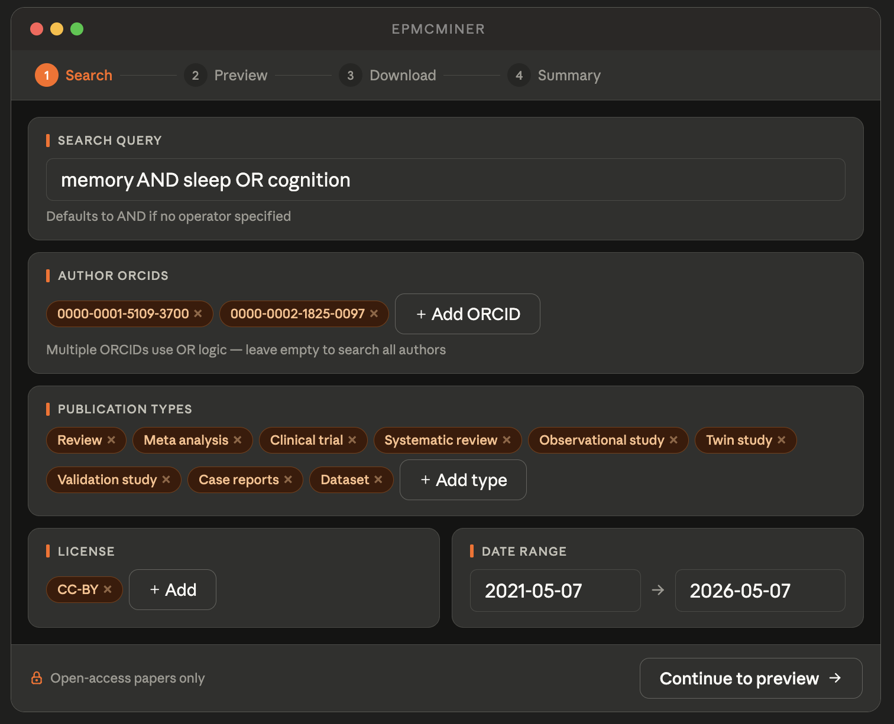
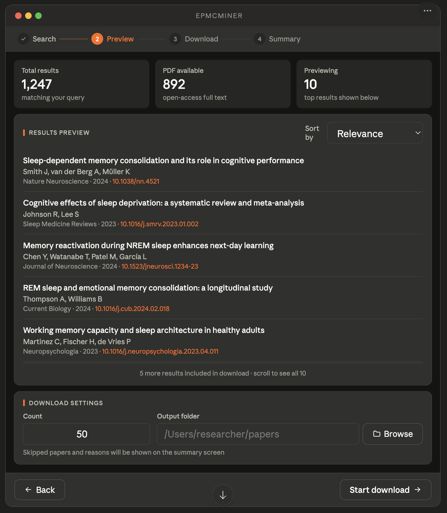
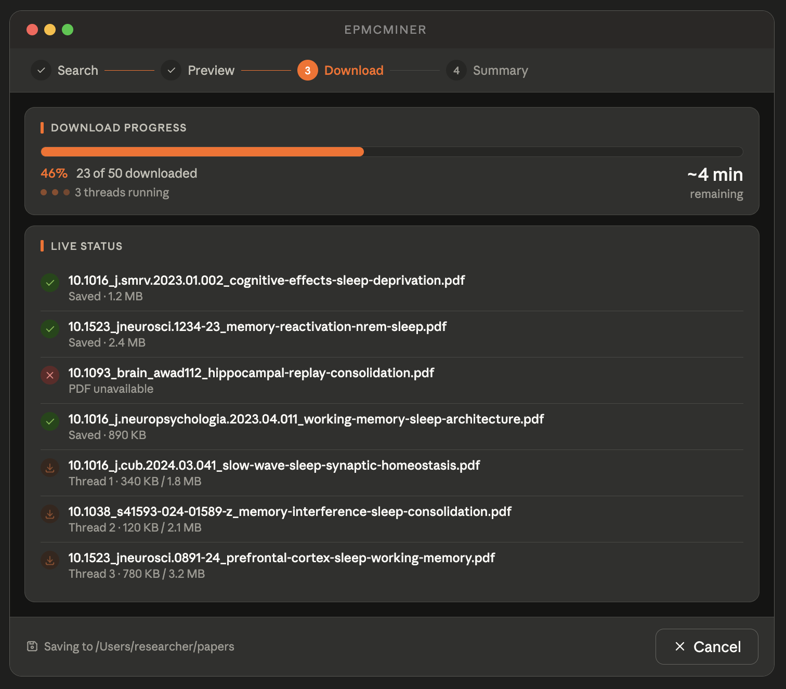
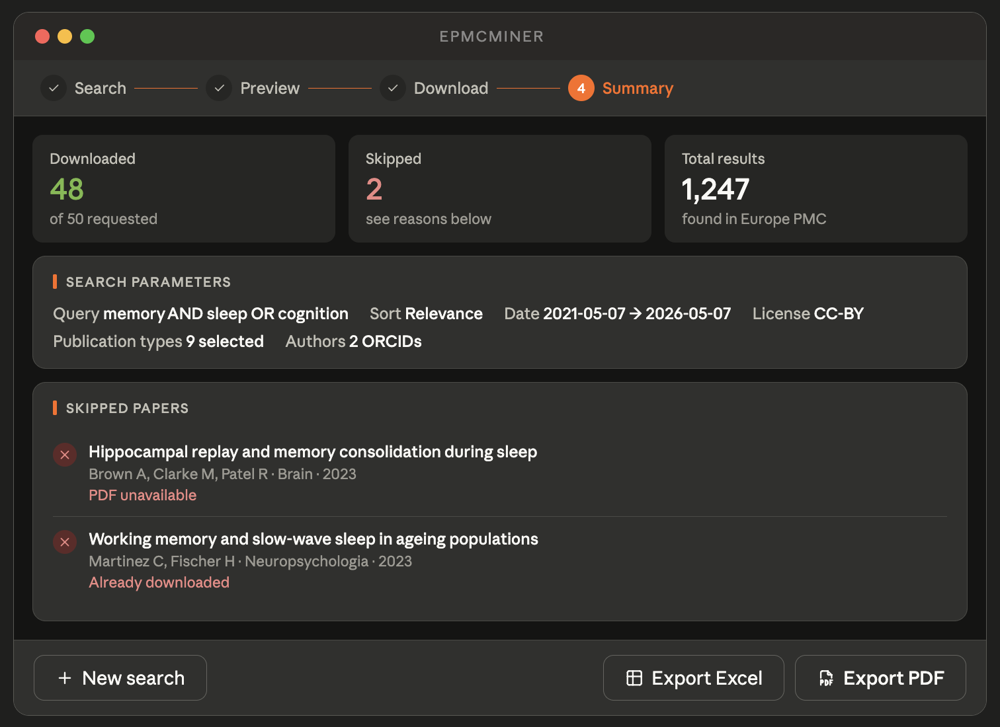

# epmcminer

## Table of Contents

<!-- TOC start (generated with https://github.com/derlin/bitdowntoc) -->

- [Overview](#overview)
- [Usage](#usage)
- [Development](#development)
- [Screenshots](#screenshots)
  * [Screen 1 - Search and filter configuration](#screen-1-search-and-filter-configuration)
  * [Screen 2 - Results preview and download settings](#screen-2-results-preview-and-download-settings)
  * [Screen 3 - Download progress](#screen-3-download-progress)
  * [Screen 4 - Summary report](#screen-4-summary-report)
- [Feature specifications](#feature-specifications)
  * [F1: Keyword search input](#f1-keyword-search-input)
  * [F2: Search filters](#f2-search-filters)
  * [F3: Results preview screen](#f3-results-preview-screen)
  * [F4: Sort order](#f4-sort-order)
  * [F5: Download settings](#f5-download-settings)
  * [F6: Parallel downloading with progress tracking](#f6-parallel-downloading-with-progress-tracking)
  * [F7: Output folder structure](#f7-output-folder-structure)
  * [F8: Summary report screen](#f8-summary-report-screen)
  * [F9: Europe PMC API integration](#f9-europe-pmc-api-integration)
  * [F10: Logging](#f10-logging)
- [User stories](#user-stories)
  * [US1: Searching and downloading papers (primary happy path)](#us1-searching-and-downloading-papers-primary-happy-path)
  * [US2: Adjusting filters after preview](#us2-adjusting-filters-after-preview)
  * [US3: Repeat run into the same folder](#us3-repeat-run-into-the-same-folder)
  * [US4: Exporting the summary report](#us4-exporting-the-summary-report)

<!-- TOC end -->

<!-- TOC --><a name="overview"></a>
## Overview

A desktop application for researchers that automates the retrieval of academic literature from the [Europe PubMed Central (Europe PMC) API](https://europepmc.org/RestfulWebService). It allows users to define a search query and a set of filters, preview matching results, and download up to a specified number of open-access papers — including their PDFs and metadata — into a structured local folder.

epmcminer is designed for researchers in psychology and adjacent fields who need to systematically collect literature without manual searching and downloading. It requires no programming knowledge and provides a clean, step-by-step interface that guides the user from query construction to a downloadable report of results.

epmcminer only retrieves papers that are freely and legally available in full text. Papers that cannot be downloaded are clearly flagged in the final report with a reason. All searches are logged locally for reproducibility, and previously downloaded papers are automatically skipped on repeat runs.

**Core capabilities:**
- Keyword search with AND/OR logic against the Europe PMC database
- Filtering by date range, publication type, license, and author (via ORCID)
- Live results preview with adjustable sort order before committing to a download
- Parallel downloading of up to a user-specified count of PDFs with a real-time progress indicator
- A summary report exportable as PDF or Excel, containing the search query, filters applied, download results, paper metadata, and reasons for any skipped papers

---

<!-- TOC --><a name="usage"></a>
## Usage

### System prerequisites (Linux only)

PyQt6 requires two OpenGL/EGL system libraries that are not always present on minimal Linux installs:

```bash
sudo apt-get install -y libegl1 libgl1
```

macOS and Windows users do not need this step.

### Install and run

First, activate your virtual environment and install the package:

```bash
source venv/bin/activate
pip install -e ".[dev]"
```

Then launch the application using either of the following:

```bash
# as a module
python -m epmcminer

# via the installed script
epmcminer
```

<!-- TOC --><a name="development"></a>
## Development
Useful commands for development and testing
```python
# activate local virtual environment (if set up previously)
source .venv/bin/activate

# install package from root folder
pip install -e .
```

<!-- TOC --><a name="screenshots"></a>
## Screenshots
Note: these are early mockups and may not reflect the final design, screenshots will be added once the UI is implemented.

<!-- TOC --><a name="screen-1-search-and-filter-configuration"></a>
### Screen 1 - Search and filter configuration


<!-- TOC --><a name="screen-2-results-preview-and-download-settings"></a>
### Screen 2 - Results preview and download settings


<!-- TOC --><a name="screen-3-download-progress"></a>
### Screen 3 - Download progress


<!-- TOC --><a name="screen-4-summary-report"></a>
### Screen 4 - Summary report


<!-- TOC --><a name="feature-specifications"></a>
## Feature specifications

<!-- TOC --><a name="f1-keyword-search-input"></a>
### F1: Keyword search input

Users can enter a search query using free text. If no boolean operators are specified, AND logic is assumed between words. Users can explicitly use AND or OR operators (case-insensitive) to control query logic.

---

<!-- TOC --><a name="f2-search-filters"></a>
### F2: Search filters

The following filters are available on the search screen.

**Date range**
Two date pickers for start and end date. Default: start = 5 years ago, end = today. The end date is capped at today.

**Publication type**
A tag-style input field pre-loaded with the following default types: Review, Meta analysis, Clinical trial, Systematic review, Comparative study, Observational study, Randomized controlled trial, Twin study, Validation study, Case reports, Dataset, Corrected and republished article, Clinical study, Evaluation study, Multicenter study, Observational study (veterinary), Randomized controlled trial (veterinary), Books. The user can remove any tag or add new ones from a dropdown of all types available in the Europe PMC API. At least one type must be selected.

**License**
A tag-style input field. Default: CC-BY. Options match those available on the Europe PMC website. At least one license must be selected.

**Author (ORCID)**
A tag-style input field. The user can add one or more ORCID identifiers. Multiple ORCIDs use OR logic. The field can be left empty to search across all authors.

**Full-text availability**
Not a user-facing filter — hardcoded requirement that all results must have a freely available full text (`HAS_FT:Y OR HAS_FREE_FULLTEXT:Y`). This is communicated to the user via a lock icon in the action bar.

---

<!-- TOC --><a name="f3-results-preview-screen"></a>
### F3: Results preview screen

When the user clicks "Continue to preview", a progress animation is displayed while the app queries the API and gathers results. This uses the same visual style as the download progress bar for consistency. Once results are ready, the animation is replaced by the preview content, which includes:

- Total number of results found in the API matching the query
- Estimated number of downloadable papers (those with confirmed PDF availability)
- A list of the first 10 results showing: title, authors, journal, year, DOI
- A sort order selector (see F4) in the preview list header
- A "Back" button to return to Screen 1 and adjust filters
- Download settings (count and output folder) below the preview list
- A "Start download" button, disabled until both count and output folder are filled in

---

<!-- TOC --><a name="f4-sort-order"></a>
### F4: Sort order

A sort order selector is shown in the results preview header on Screen 2. Options are Relevance (default), Date (newest first), and Citations (most cited first). When the user changes the sort order:

- The results list is immediately replaced by the same progress animation used when first loading the preview
- The app re-queries the Europe PMC API with the updated sort parameter
- Once results return, the animation is replaced by the refreshed top 10 results and updated stat cards
- The sort order selected at the time the user clicks "Start download" is the one applied to the full download and recorded in the final report

---

<!-- TOC --><a name="f5-download-settings"></a>
### F5: Download settings

These settings are configured on Screen 2 (the preview screen) after the user has seen what results are available.

**Count**: an integer input specifying the number of successfully downloaded papers desired. The tool keeps retrieving results until count papers are downloaded or the API returns no more results.

**Output folder**: the user selects a local folder via a folder picker dialog.

---

<!-- TOC --><a name="f6-parallel-downloading-with-progress-tracking"></a>
### F6: Parallel downloading with progress tracking

PDFs are downloaded in parallel using multithreading. Screen 3 shows:

- A full-width progress bar with percentage and count (e.g. "46% · 23 of 50 downloaded")
- Estimated time remaining displayed to the right of the progress stats
- Animated thread indicators showing the number of active threads
- A live status log showing each download attempt with its outcome (saved, skipped, or in progress), file name, and per-thread byte progress for active downloads
- The output folder path echoed in the action bar
- A cancel button to abort the download

The UI remains responsive during downloading (non-blocking).

---

<!-- TOC --><a name="f7-output-folder-structure"></a>
### F7: Output folder structure

Downloaded content is saved in the user-specified folder as follows:

```
output_folder/
  pdfs/
    {doi}_{title}.pdf
    ...
  logs/
    YYYY-MM-DD_HH-MM.log
  report.csv
```

PDF filenames are constructed as `{doi}_{title}.pdf` with special characters sanitised. If a PDF already exists in the folder from a previous run, it is skipped and noted in the report. One log file is created per run, timestamped at start time.

---

<!-- TOC --><a name="f8-summary-report-screen"></a>
### F8: Summary report screen

After downloading completes, Screen 4 shows a summary containing:

- Search query used
- All filters applied, including sort order
- Total results found in the API
- Number of papers successfully downloaded
- Number of papers skipped, each with a reason (e.g. PDF unavailable, already downloaded, download failed)
- A table of all processed papers with columns: title, authors, journal, year, DOI, status, skip reason

The report is also saved automatically as `report.csv` in the output folder. An export button allows the user to save the report as Excel (.xlsx) or PDF (.pdf).

---

<!-- TOC --><a name="f9-europe-pmc-api-integration"></a>
### F9: Europe PMC API integration

A dedicated API module handles all communication with Europe PMC:

- Constructs and sends search queries with all filter parameters and sort order
- Paginates through results to reach the requested count of successful downloads
- Retrieves full metadata per paper
- Resolves and downloads PDF files from full-text URLs
- Handles API errors, rate limits, and timeouts gracefully, logging all failures

---

<!-- TOC --><a name="f10-logging"></a>
### F10: Logging

Each run produces a timestamped log file in `output_folder/logs/`. The log records:

- Run start and end time
- Full query sent to the API, including sort order
- Each download attempt and its outcome
- Any API errors or unexpected failures

---

<!-- TOC --><a name="user-stories"></a>
## User stories

<!-- TOC --><a name="us1-searching-and-downloading-papers-primary-happy-path"></a>
### US1: Searching and downloading papers (primary happy path)

**As** a psychology researcher, **I want** to search for papers on a topic with specific filters and download a set number of available PDFs into a folder on my computer, **so that** I can efficiently build a literature collection without manually searching and downloading.

**Preconditions:**
- epmcminer is installed and running
- The user has an internet connection

**Steps:**

1. User opens epmcminer.
2. User enters keywords and configures filters: date range, publication types, license, and optionally one or more author ORCIDs.
3. User clicks "Continue to preview". A progress animation is shown while the app queries the Europe PMC API.
4. The app displays the results preview: total results found, estimated downloadable count, and the first 10 papers.
5. User optionally changes the sort order. The progress animation plays again, the API is re-queried, and the preview refreshes live with the updated results.
6. User reviews the preview, sets count and selects an output folder.
7. User clicks "Start download".
8. The app downloads papers in parallel. Screen 3 shows a progress bar, estimated time remaining, active thread indicators, and a live status log.
9. Download completes. Screen 4 shows the summary: papers downloaded, papers skipped with reasons, and a full results table.
10. User optionally exports the report as Excel or PDF.

**Postconditions:**
- PDFs are saved in `output_folder/pdfs/`
- `report.csv` is saved in `output_folder/`
- A timestamped log file is saved in `output_folder/logs/`
- Any previously existing PDFs in the folder were skipped and noted in the report

---

<!-- TOC --><a name="us2-adjusting-filters-after-preview"></a>
### US2: Adjusting filters after preview

**As** a psychology researcher, **I want** to go back and refine my search after seeing the preview results, **so that** I don't waste time downloading papers that are not relevant.

**Steps:**

1. User reaches Screen 2 and finds the preview results unsatisfactory.
2. User clicks "Back".
3. The app returns to Screen 1 with all previously entered filters intact.
4. User adjusts one or more filters and clicks "Continue to preview" again.
5. Flow continues as per US1 from step 3.

---

<!-- TOC --><a name="us3-repeat-run-into-the-same-folder"></a>
### US3: Repeat run into the same folder

**As** a psychology researcher, **I want** to run the same or a similar search into a folder I have used before, **so that** I can top up my collection without re-downloading papers I already have.

**Steps:**

1. User runs epmcminer and selects an output folder that already contains previously downloaded PDFs.
2. The app proceeds normally through search, preview, and download.
3. During downloading, any PDF whose filename already exists in `output_folder/pdfs/` is skipped automatically.
4. Skipped-because-already-exists papers are listed in the summary report with the reason "Already downloaded".

---

<!-- TOC --><a name="us4-exporting-the-summary-report"></a>
### US4: Exporting the summary report

**As** a psychology researcher, **I want** to export the summary report after a download, **so that** I have a record of what was retrieved that I can share or archive.

**Steps:**

1. User reaches Screen 4 after a completed download.
2. User reviews the summary table.
3. User clicks "Export" and selects a format: Excel (.xlsx) or PDF (.pdf).
4. The app generates and saves the file to a location chosen by the user via a save dialog.